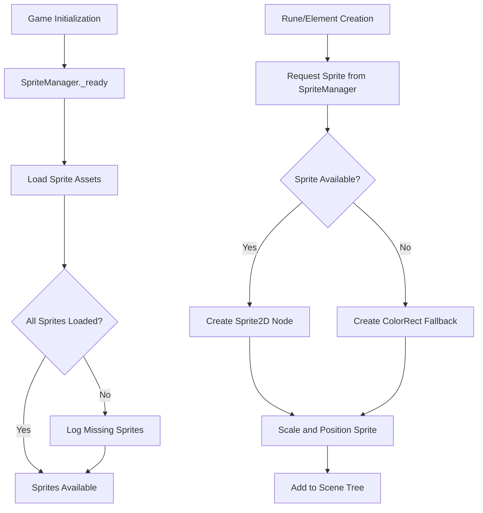

# Design Document: Sprite Graphics Integration

## Overview

This feature replaces the current `_draw()` method-based rendering in Rune and Element classes with Sprite2D nodes displaying PNG sprite assets. The design maintains backward compatibility through a fallback system that reverts to the current ColorRect-style rendering when sprites are missing.

The implementation follows Godot 4.3 best practices for asset management and node composition, ensuring sprites integrate seamlessly with existing game mechanics including rotation, gravity, collision detection, and match-4 removal.

### Key Design Goals

- Replace custom drawing code with Sprite2D nodes for visual polish
- Maintain all existing gameplay mechanics without modification
- Provide graceful fallback to colored shapes when sprites are unavailable
- Support easy asset swapping for future visual iterations
- Ensure proper attribution and licensing compliance

## Architecture

### Component Overview

The sprite integration touches three main areas of the codebase:

1. **Asset Management Layer**: A new `SpriteManager` singleton responsible for loading, caching, and providing access to sprite resources
2. **Visual Representation Layer**: Modified `Rune` and `Element` classes that use Sprite2D nodes instead of custom drawing
3. **Fallback System**: Logic within Rune/Element classes to detect missing sprites and revert to ColorRect rendering

### System Diagram



### Directory Structure

```
assets/
  sprites/
    fire/
      rune_fire.png
      element_fire.png
    water/
      rune_water.png
      element_water.png
    earth/
      rune_earth.png
      element_earth.png
    air/
      rune_air.png
      element_air.png
    CREDITS.md
```

## Components and Interfaces

### SpriteManager (New Singleton)

A singleton autoload that manages sprite loading and access.

**Responsibilities:**
- Load all sprite assets during game initialization
- Cache loaded sprites in memory for fast access
- Provide sprite lookup by element type and piece type (rune/element)
- Track and log missing sprite files
- Expose fallback status for debugging

**Interface:**

```gdscript
class_name SpriteManager
extends Node

# Sprite cache structure: { ElementType: { "rune": Texture2D, "element": Texture2D } }
var sprite_cache: Dictionary = {}
var missing_sprites: Array[String] = []

# Load all sprites during initialization
func _ready() -> void

# Get sprite texture for a specific type and piece
func get_sprite(element_type: int, piece_type: String) -> Texture2D

# Check if a specific sprite is available
func has_sprite(element_type: int, piece_type: String) -> bool

# Get list of missing sprites for debugging
func get_missing_sprites() -> Array[String]
```

**Implementation Notes:**
- Uses `load()` to load PNG files from the sprites directory
- Stores Texture2D references in a nested dictionary structure
- Logs warnings for missing files but continues initialization
- Sprite paths follow pattern: `res://assets/sprites/{type_name}/{piece_type}_{type_name}.png`

### Modified Rune Class

**Changes from Current Implementation:**
- Remove `_draw()` method and custom drawing code
- Add `@onready var sprite_node: Node2D` to hold either Sprite2D or ColorRect
- Initialize sprite/fallback in `_ready()` based on SpriteManager availability
- Maintain existing `set_rune_type()` interface for compatibility

**New Structure:**

```gdscript
extends Node2D
class_name Rune

enum RuneType { FIRE, WATER, EARTH, AIR }

@export var rune_type: RuneType = RuneType.FIRE
@export var grid_x: int = 0
@export var grid_y: int = 0

var sprite_node: Node2D  # Either Sprite2D or ColorRect
var colors = {
	RuneType.FIRE: Color.RED,
	RuneType.WATER: Color.BLUE,
	RuneType.EARTH: Color.SADDLE_BROWN,
	RuneType.AIR: Color.LIGHT_GRAY
}

func _ready():
	_create_visual_representation()

func _create_visual_representation():
	# Try to load sprite, fall back to ColorRect if unavailable
	
func set_rune_type(type: RuneType):
	# Update visual representation when type changes
```

### Modified Element Class

**Changes from Current Implementation:**
- Remove `_draw()` method and custom drawing code
- Add `@onready var sprite_node: Node2D` to hold either Sprite2D or ColorRect
- Initialize sprite/fallback in `_ready()` based on SpriteManager availability
- Maintain existing `set_element_type()` interface for compatibility

**Structure mirrors Rune class** with Element-specific sprite requests.

### Sprite Scaling System

**Scaling Logic:**
- Target size: `CELL_SIZE` from GameBoard (currently 50 pixels)
- Calculate scale factor: `scale = CELL_SIZE / max(sprite_width, sprite_height)`
- Apply uniform scale to maintain aspect ratio
- Center sprite within cell using position offset

**Implementation:**

```gdscript
func _scale_sprite_to_cell(sprite: Sprite2D) -> void:
	var texture_size = sprite.texture.get_size()
	var max_dimension = max(texture_size.x, texture_size.y)
	var scale_factor = GameBoard.CELL_SIZE / max_dimension
	sprite.scale = Vector2(scale_factor, scale_factor)
```

### Fallback Rendering System

**Trigger Conditions:**
- Sprite file not found during SpriteManager initialization
- Texture loading fails (corrupted file, wrong format)
- SpriteManager not available (shouldn't happen with autoload)

**Fallback Implementation:**

```gdscript
func _create_fallback_visual(piece_type: String) -> ColorRect:
	var rect = ColorRect.new()
	rect.custom_minimum_size = Vector2(36, 36)  # Slightly smaller than cell
	rect.position = Vector2(-18, -18)  # Center in cell
	rect.color = colors[rune_type if piece_type == "rune" else element_type]
	
	# Add border for visual clarity
	# Note: ColorRect doesn't support borders directly, 
	# so we'll keep the current _draw() approach for fallback
	return rect
```

**Alternative Fallback Approach:**
Since ColorRect doesn't support borders easily, the fallback will actually keep the current `_draw()` method approach but only activate it when sprites are unavailable. This maintains visual consistency with the current implementation.

## Data Models

### Sprite Cache Structure

```gdscript
# SpriteManager.sprite_cache structure
{
	Rune.RuneType.FIRE: {
		"rune": Texture2D,      # res://assets/sprites/fire/rune_fire.png
		"element": Texture2D    # res://assets/sprites/fire/element_fire.png
	},
	Rune.RuneType.WATER: {
		"rune": Texture2D,
		"element": Texture2D
	},
	Rune.RuneType.EARTH: {
		"rune": Texture2D,
		"element": Texture2D
	},
	Rune.RuneType.AIR: {
		"rune": Texture2D,
		"element": Texture2D
	}
}
```

### Sprite File Naming Convention

- Pattern: `{piece_type}_{element_type}.png`
- Examples:
  - `rune_fire.png`
  - `element_water.png`
  - `rune_earth.png`
  - `element_air.png`

### Credits Data Model

```markdown
# Sprite Credits

## Fire Sprites
- **Source**: [Artist Name / Source URL]
- **License**: [License Type]
- **Modifications**: [None / Description]

## Water Sprites
- **Source**: [Artist Name / Source URL]
- **License**: [License Type]
- **Modifications**: [None / Description]

[... repeat for Earth and Air ...]
```


## Correctness Properties

*A property is a characteristic or behavior that should hold true across all valid executions of a system—essentially, a formal statement about what the system should do. Properties serve as the bridge between human-readable specifications and machine-verifiable correctness guarantees.*

### Property 1: Sprite Cache Completeness

*For any* element type in the game (Fire, Water, Earth, Air), the SpriteManager sprite cache should contain exactly two sprite entries: one for the rune variant and one for the element variant.

**Validates: Requirements 1.2**

### Property 2: Type-Sprite Correspondence

*For any* game piece (Rune or Element) created with a specific element type, the displayed sprite should correspond to that element type (e.g., Fire rune shows fire sprite, Water element shows water sprite).

**Validates: Requirements 2.1, 3.1**

### Property 3: Sprite Node Usage

*For any* game piece (Rune or Element) when sprite assets are available, the visual representation node should be a Sprite2D instance rather than using the fallback rendering.

**Validates: Requirements 2.2, 3.2**

### Property 4: Sprite Scaling and Positioning

*For any* sprite with any dimensions, after scaling it should: (1) fit within CELL_SIZE bounds, (2) maintain its original aspect ratio, and (3) be centered within its grid cell position.

**Validates: Requirements 2.3, 3.3, 6.1, 6.2, 6.3, 6.4, 6.5**

### Property 5: Sprite Orientation Preservation

*For any* rune that undergoes rotation, the sprite should maintain its visual orientation relative to the rune's coordinate system (the sprite rotates with the rune, not independently).

**Validates: Requirements 5.1**

### Property 6: Sprite Position Synchronization

*For any* game piece (Rune or Element) at any point during gameplay, the sprite's world position should match the game object's position.

**Validates: Requirements 5.2**

### Property 7: Sprite Lifecycle Coupling

*For any* game piece that is removed from the game (due to matching or cleanup), its sprite node should also be removed from the scene tree.

**Validates: Requirements 5.3**

### Property 8: Game Logic Independence

*For any* game state and any sequence of game actions (movement, rotation, collision detection, grid placement), the behavior should be identical whether using sprite rendering or fallback rendering.

**Validates: Requirements 5.4, 5.5**

### Property 9: Fallback Activation

*For any* element type where the sprite file is missing or fails to load, the game piece should render using the fallback ColorRect/drawing method with the appropriate color for that type.

**Validates: Requirements 1.5, 8.1**

### Property 10: Missing Sprite Logging

*For any* sprite file that cannot be loaded during initialization, the SpriteManager should add an entry to its missing_sprites list and log a warning message.

**Validates: Requirements 8.2**

### Property 11: Fallback Color Consistency

*For any* element type, the color used in fallback rendering should match the color scheme specified for that type's sprites (Fire=red, Water=blue, Earth=brown, Air=light gray).

**Validates: Requirements 8.4**

## Error Handling

### Sprite Loading Errors

**Error Condition**: Sprite file not found or corrupted
- **Detection**: `load()` returns null or invalid Texture2D
- **Response**: Log warning with file path, add to missing_sprites list, continue initialization
- **Recovery**: Use fallback rendering for affected pieces
- **User Impact**: Visual downgrade but full gameplay functionality maintained

**Error Condition**: Entire sprite directory missing
- **Detection**: Multiple sprite load failures during SpriteManager._ready()
- **Response**: Log error message, populate missing_sprites list
- **Recovery**: All pieces use fallback rendering
- **User Impact**: Game runs with original colored shapes appearance

### Runtime Errors

**Error Condition**: SpriteManager not available (autoload failure)
- **Detection**: SpriteManager reference is null in Rune/Element._ready()
- **Response**: Log error, immediately use fallback rendering
- **Recovery**: Fallback rendering for all pieces
- **User Impact**: Game runs with colored shapes, error logged for debugging

**Error Condition**: Invalid element type passed to get_sprite()
- **Detection**: Type not in sprite_cache dictionary
- **Response**: Return null, caller handles with fallback
- **Recovery**: Specific piece uses fallback rendering
- **User Impact**: Single piece appears as colored shape

### Graceful Degradation Strategy

The system is designed to never crash due to missing sprites:

1. **Layer 1**: SpriteManager catches load failures and continues
2. **Layer 2**: Rune/Element classes check for null sprites before use
3. **Layer 3**: Fallback rendering provides identical gameplay experience
4. **Layer 4**: All errors logged for developer awareness

This multi-layer approach ensures the game remains playable even with incomplete or missing sprite assets, which is essential for development and testing workflows.

## Testing Strategy

### Dual Testing Approach

This feature requires both unit tests and property-based tests to ensure comprehensive coverage:

- **Unit tests** will verify specific examples, edge cases, and integration points
- **Property-based tests** will verify universal properties across randomized inputs
- Together they provide confidence in both specific scenarios and general correctness

### Unit Testing Focus

Unit tests should cover:

1. **Sprite Loading Examples**
   - Test that SpriteManager successfully loads a valid PNG file
   - Test that SpriteManager handles a missing file gracefully
   - Test that sprite_cache is populated correctly after initialization

2. **Fallback Rendering Examples**
   - Test that a Rune with missing sprite creates fallback visual
   - Test that fallback colors match the color scheme (Fire=red, etc.)
   - Test that fallback rendering produces the same grid behavior

3. **Integration Points**
   - Test that Rune._ready() correctly requests sprite from SpriteManager
   - Test that Element._ready() correctly requests sprite from SpriteManager
   - Test that sprite nodes are properly added to scene tree
   - Test that sprite removal happens when piece is queue_free()'d

4. **Edge Cases**
   - Empty sprites directory (all fallback)
   - Partially missing sprites (some types have sprites, others don't)
   - Very large sprite files (scaling down)
   - Very small sprite files (scaling up)
   - Non-square sprites (aspect ratio preservation)

### Property-Based Testing Configuration

**Testing Library**: Use GUT (Godot Unit Test) framework with custom property test helpers, or implement a simple property test runner that generates random inputs and runs assertions multiple times.

**Test Configuration**:
- Minimum 100 iterations per property test
- Each test tagged with feature name and property number
- Tag format: `# Feature: sprite-graphics-integration, Property {N}: {property text}`

**Property Test Implementations**:

1. **Property 1: Sprite Cache Completeness**
   - Generate: All element types (0-3)
   - Assert: For each type, sprite_cache[type] contains "rune" and "element" keys
   - Tag: `# Feature: sprite-graphics-integration, Property 1: Sprite cache has exactly 2 variants per type`

2. **Property 2: Type-Sprite Correspondence**
   - Generate: Random element types and piece types (rune/element)
   - Create: Piece with that type
   - Assert: Sprite texture matches expected sprite for that type
   - Tag: `# Feature: sprite-graphics-integration, Property 2: Pieces display correct sprite for their type`

3. **Property 3: Sprite Node Usage**
   - Generate: Random element types
   - Setup: Ensure sprites are available
   - Create: Piece with that type
   - Assert: Visual node is Sprite2D instance
   - Tag: `# Feature: sprite-graphics-integration, Property 3: Pieces use Sprite2D when sprites available`

4. **Property 4: Sprite Scaling and Positioning**
   - Generate: Random sprite dimensions (width, height)
   - Calculate: Expected scale factor
   - Assert: Scaled sprite fits in CELL_SIZE, aspect ratio preserved, centered
   - Tag: `# Feature: sprite-graphics-integration, Property 4: Sprites scaled and centered correctly`

5. **Property 5: Sprite Orientation Preservation**
   - Generate: Random rune types and rotation states
   - Create: Rune and rotate it
   - Assert: Sprite rotation matches rune rotation
   - Tag: `# Feature: sprite-graphics-integration, Property 5: Sprite orientation preserved during rotation`

6. **Property 6: Sprite Position Synchronization**
   - Generate: Random grid positions
   - Create: Piece at that position
   - Move: Piece to new position
   - Assert: Sprite world position matches piece position
   - Tag: `# Feature: sprite-graphics-integration, Property 6: Sprite position syncs with game object`

7. **Property 7: Sprite Lifecycle Coupling**
   - Generate: Random pieces
   - Create: Piece and get sprite node reference
   - Remove: Piece with queue_free()
   - Assert: Sprite node is also removed (not in scene tree)
   - Tag: `# Feature: sprite-graphics-integration, Property 7: Sprites removed with game objects`

8. **Property 8: Game Logic Independence**
   - Generate: Random game states (grid configurations)
   - Test: Collision detection, grid placement with sprites enabled
   - Test: Same operations with fallback mode
   - Assert: Results are identical
   - Tag: `# Feature: sprite-graphics-integration, Property 8: Game logic identical with sprites or fallback`

9. **Property 9: Fallback Activation**
   - Generate: Random element types
   - Setup: Remove sprite file for that type
   - Create: Piece with that type
   - Assert: Uses fallback rendering (not Sprite2D)
   - Tag: `# Feature: sprite-graphics-integration, Property 9: Missing sprites trigger fallback`

10. **Property 10: Missing Sprite Logging**
    - Generate: Random sprite file paths
    - Setup: Make some files missing
    - Initialize: SpriteManager
    - Assert: missing_sprites list contains all missing files
    - Tag: `# Feature: sprite-graphics-integration, Property 10: Missing sprites are logged`

11. **Property 11: Fallback Color Consistency**
    - Generate: All element types
    - Setup: Force fallback mode
    - Create: Piece with that type
    - Assert: Fallback color matches type's color scheme
    - Tag: `# Feature: sprite-graphics-integration, Property 11: Fallback colors match sprite color scheme`

### Test Execution Strategy

1. Run unit tests first to verify basic functionality
2. Run property tests with 100+ iterations to verify general correctness
3. Use GUT's test runner to execute all tests in CI/CD pipeline
4. Monitor test execution time (property tests may be slower)
5. Generate test reports showing property test iteration counts

### Testing Challenges and Solutions

**Challenge**: Testing visual appearance (colors, sprites)
- **Solution**: Test the data (which sprite is loaded, which color is set) rather than rendering output

**Challenge**: Testing file I/O (sprite loading)
- **Solution**: Use test fixtures with known sprite files, test with missing files

**Challenge**: Property tests in Godot/GDScript
- **Solution**: Implement simple property test helper that runs assertions N times with random inputs

**Challenge**: Testing scene tree operations (node addition/removal)
- **Solution**: Use GUT's test scene setup, verify node counts and types in tree
